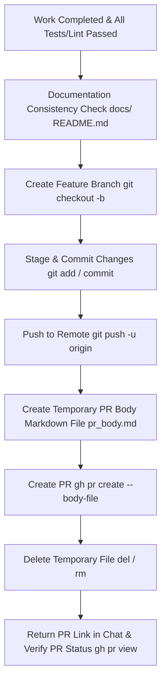

# GitHub PR Workflow Guide

Guidelines for safely and reliably executing feature branch creation, Pull Request creation, and updates using GitHub CLI (`gh`) and Git.

---

## 1. Workflow Overview



---

## 2. Gotchas & Rules

### ⚠️ Documentation Consistency Check Before PR Creation (Required)
- **Synchronize `docs/` using the implementation code as the Source of Truth**:
  - Before creating a PR, always review design documents under `docs/` (e.g., [`docs/design.md`](docs/design.md)), detailed implementation guides (`docs/phase*_implementation_guide.md`), and the top-level [`README.md`](README.md).
  - If there are any discrepancies between the code and documentation due to specification changes, model definition updates, endpoint/command changes, or file path changes during implementation, **update the documentation to match the code completely before** proceeding to commit and PR creation.

### ⚠️ Multi-line Argument Truncation in Windows (`cmd.exe` / `PowerShell`)
- **Prohibition of Inline `--body "..."`**:
  - In `cmd.exe` or PowerShell, newline characters (`\n` / `\r\n`) inside command line arguments cause truncation, resulting in only the first line (e.g., `## Summary`) being applied.
- **Always Use `--body-file`**:
  - When creating or editing multi-line PR bodies, always write the full content to a temporary Markdown file (e.g., `pr_body.md`), and specify `--body-file pr_body.md`.
  - Immediately delete the temporary file after command execution completes.

---

## 3. Standard Execution Steps

### Step 1: Documentation Consistency Check Based on Implementation Code
Before creating a PR, thoroughly check whether the implemented code is consistent with the following documents, and update them as needed.

1. **[`docs/design.md`](docs/design.md)**: Overall architecture, ER diagrams, endpoint list, roadmap status
2. **`docs/phase*_implementation_guide.md`**: Implementation guides, code examples, configuration values for each phase
3. **[`README.md`](README.md)**: Setup, startup commands, dependencies

### Step 2: Branch Creation and Commit
Create a branch with an appropriate prefix (`feat/`, `fix/`, `refactor/`, `docs/`, etc.) according to the task content.

```bash
# Create and checkout branch
git checkout -b feat/<branch-name>

# Stage and commit changes
git add .
git commit -m "feat: <concise commit message>"
```

### Step 3: Push to Remote Repository
```bash
git push -u origin feat/<branch-name>
```

### Step 4: Create PR Body File (`pr_body.md`)
Write out the full Markdown following the standard template below into a temporary file.

```markdown
## Summary
<Briefly describe the goal and purpose of the corresponding task or phase>

## Changes
1. **<Component/Module Name>**:
   - <Specific change 1>
   - <Specific change 2>
2. **<Documentation/Tests, etc.>**:
   - <Added or updated content>

## Verification Results
- <Results of tests executed (pytest, vitest, etc.)>
- <Results of type checks (mypy, tsc, etc.) and Lint>
- <Browser or manual connection test results>
```

### Step 5: Create PR, Clean Up Temporary File, and Return Link
```bash
# Create PR
gh pr create --title "<Title (feat/fix/etc)>" --body-file pr_body.md

# Delete temporary file (For Windows cmd.exe)
del pr_body.md

# (For Linux / macOS: rm pr_body.md)
```

### Step 6: Return PR Link in Chat
After creating the PR, output the URL/link of the created PR in the chat message to inform the user.

```bash
# View PR details and get the URL
gh pr view --web
# or view details in terminal to copy URL
gh pr view
```

---

## 4. Existing PR Body Update Procedure

When modifying or updating an existing PR body, use `--body-file` as well.

```bash
# 1. Create temporary file pr_body.md
# 2. Update PR
gh pr edit <PR number> --body-file pr_body.md

# 3. Delete temporary file
del pr_body.md
```
