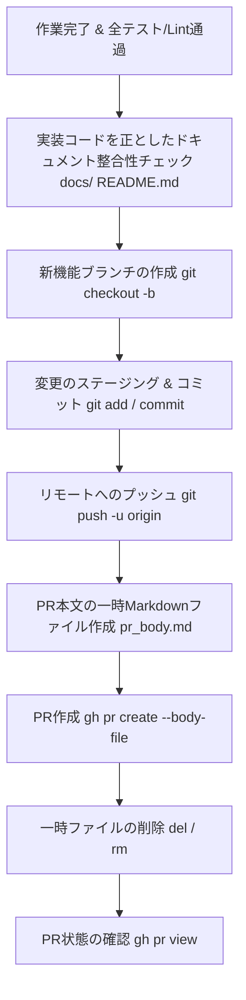

# GitHub PR Workflow Guide

GitHub CLI (`gh`) および Git を利用して、機能ブランチの作成から Pull Request の作成・更新までを安全かつ確実に実行するためのワークフローガイドラインです。

---

## 1. ワークフロー概要



---

## 2. 重要なルール・制約（Gotchas & Rules）

### ⚠️ PR 作成前のドキュメント整合性チェック（必須）
- **実装コードを正（Source of Truth）として `docs/` 配下を同期**:
  - PR 作成前に必ず `docs/` 配下の設計書（[`docs/design.md`](docs/design.md) 等）、詳細手順書（`docs/phase*_implementation_guide.md`）、トップ階層の [`README.md`](README.md) を確認します。
  - 実装中に生じた仕様変更・モデル定義の更新・エンドポイントやコマンドの変更・ファイルパスの変更など、コードとドキュメントの間で乖離がある場合は、**コードに合わせてドキュメント側を漏れなく更新してから** コミット・PR 作成に進んでください。

### ⚠️ Windows (`cmd.exe` / `PowerShell`) での複数行引数切断問題
- **インライン `--body "..."` の禁止**:
  - `cmd.exe` や PowerShell では、コマンドライン引数内の改行文字（`\n` / `\r\n`）で引数が切断され、1行目（例: `## 概要`）しか反映されない致命的な問題が発生します。
- **必ず `--body-file` を使用すること**:
  - 複数行の PR 本文を作成・編集する際は、必ず一時 Markdown ファイル（例: `pr_body.md`）に完全な内容を書き出した上で、`--body-file pr_body.md` オプションを指定して実行してください。
  - コマンド実行完了後は、一時ファイルを即座に削除してください。

---

## 3. 標準実行手順

### Step 1: 実装コードを正としたドキュメント整合性チェック
PR 作成前に、実装したコード内容と以下のドキュメント群の記述に齟齬がないか必ず精査し、必要に応じてドキュメントを更新します。

1. **[`docs/design.md`](docs/design.md)**: 全体設計・ER図・エンドポイント一覧・ロードマップ状態
2. **`docs/phase*_implementation_guide.md`**: 各フェーズの実装手順書・コード例・設定値
3. **[`README.md`](README.md)**: セットアップ・起動コマンド・依存関係

### Step 2: サブモジュールの更新
サブモジュール（`vendor/` 配下）を更新します。

```bash
# 全サブモジュールを一括で最新に更新
git submodule update --remote
```

### Step 3: ブランチ作成とコミット
作業内容に応じた適切なプレフィックス（`feat/`, `fix/`, `refactor/`, `docs/` 等）を付与したブランチを作成します。

```bash
# ブランチ作成とチェックアウト
git checkout -b feat/<branch-name>

# 変更のステージングとコミット
git add .
git commit -m "feat: <簡潔なコミットメッセージ>"
```

### Step 4: リモートリポジトリへの Push
```bash
git push -u origin feat/<branch-name>
```

### Step 5: PR 本文ファイルの作成 (`pr_body.md`)
以下の標準テンプレートに沿って、完全な Markdown を一時ファイルに書き出します。

```markdown
## 概要
<対応したタスクやフェーズのゴール・目的を簡潔に記載>

## 変更内容
1. **<コンポーネント/モジュール名>**:
   - <具体的な変更内容 1>
   - <具体的な変更内容 2>
2. **<ドキュメント/テスト等>**:
   - <追加・更新した内容>

## 検証結果
- <実行したテスト（pytest, vitest 等）の結果>
- <型チェック（mypy, tsc 等）および Lint の結果>
- <ブラウザや手動での疎通確認結果>
```

### Step 6: PR の作成と一時ファイルのクリーンアップ
```bash
# PR の作成
gh pr create --title "<日本語タイトル (feat/fix/etc)>" --body-file pr_body.md

# 一時ファイルの削除 (Windows cmd.exe の場合)
del pr_body.md

# (Linux / macOS の場合: rm pr_body.md)
```

### Step 7: 作成結果の確認
```bash
gh pr view <PR番号または最新>
```

---

## 4. 既存 PR の本文更新手順

既存の PR の本文を修正・再更新する場合も同様に `--body-file` を使用します。

```bash
# 1. 一時ファイル pr_body.md を作成
# 2. PR を更新
gh pr edit <PR番号> --body-file pr_body.md

# 3. 一時ファイルを削除
del pr_body.md
```
