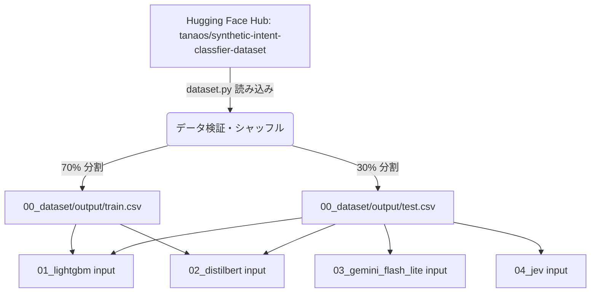

# ステップ 0: 共通データセット取得・分割の詳細実装計画書

本ドキュメントは、[`docs/experiment_plan.md`](docs/experiment_plan.md) で定義された **ステップ 0 (`00_dataset/`)** の詳細な実装計画書です。すべての後続モデル実験（LightGBM、DistilBERT、Gemini、Jev）の土台となる高品質な共通データセットの取得、検証、および分割処理の具体的な手順を定義します。

---

## 1. 目的と概要

- **目的**: Hugging Face Hub上の `tanaos/synthetic-intent-classfier-dataset` データセットを取得し、再現性を確保した上でシャッフル・分割を行い、後続の各ステップ（`01_lightgbm/`, `02_distilbert/`, `03_gemini_flash_lite/`, `04_jev/`）が入力として利用できるように `train.csv` (70%) と `test.csv` (30%) として保存する。
- **参照すべきスキル**: [`huggingface-datasets`](../../.agents/skills/huggingface-datasets/SKILL.md) （データセットの検証・ビューアAPI活用・メタデータ確認）

---

## 2. ディレクトリ構成とファイル配置

`00_dataset/` 配下の構造は以下の通りとします。

```text
00_dataset/
├── input/                   # 外部データセットのため原則空（必要に応じてHugging Faceキャッシュ）
├── tmp/                     # ダウンロード・検証中の一時データ
├── output/                  # 最終成果物
│   ├── train.csv            # 学習用データ (70%)
│   └── test.csv             # 評価用データ (30%)
└── script/                  # 実装スクリプト
    └── dataset.py           # データ取得・分割スクリプト
```

---

## 3. 実装詳細 (`00_dataset/script/dataset.py`)

### 3.1 処理フロー
1. **データセットの検証とメタデータ確認**:
   - 推奨される [`huggingface-datasets`](../../.agents/skills/huggingface-datasets/SKILL.md) スキルのワークフローに基づき、事前にデータセットの有効性（`/is-valid` や `/splits` 等）を確認する。
2. **データのロード**:
   - `datasets` ライブラリ（Hugging Face）を用いて `tanaos/synthetic-intent-classfier-dataset` をロードする。
3. **データの前処理とシャッフル**:
   - 乱数シード（例: `42`）を固定した上で、データをランダムにシャッフルする。
   - 欠損値や不正なフォーマットがないかをバリデーションする。
4. **データ分割**:
   - 全データを 70%（学習用）と 30%（評価用）に分割する。
5. **CSV出力**:
   - 分割結果をそれぞれ `00_dataset/output/train.csv` および `00_dataset/output/test.csv` として UTF-8 エンコーディングで書き出す。
   - 出力された行数、クラス分布（ラベルごとの件数）をログに出力する。

### 3.2 使用する主なライブラリ
- `datasets` (Hugging Face Datasets)
- `pandas`
- `scikit-learn` (`train_test_split` または `shuffle`)

---

## 4. Mermaid アーキテクチャ・データフロー図



---

## 5. 実行手順・確認事項

1. 依存関係のインストール（`uv add datasets pandas scikit-learn`）
2. スクリプトの実行：
   ```bash
   uv run python 00_dataset/script/dataset.py
   ```
3. 成果物の検証：
   - `00_dataset/output/train.csv` と `00_dataset/output/test.csv` が正しく生成されていること。
   - クラス分布が偏りなく分割されていることを確認する。
