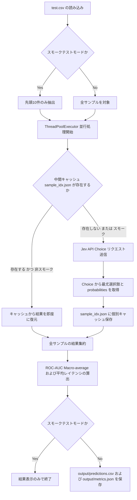

# ステップ 4: Jev モデル評価の詳細実装手順書

本ドキュメントは、[`docs/experiment_plan.md`](docs/experiment_plan.md) で定義された **ステップ 4 (`04_jev/`)** の完全かつ緻密な実装手順書です。使用するスキル、ライブラリ、ディレクトリ構造、Jev（`jev-1.13`）の `Choice` プリミティブを用いた質問・Criteria設計、並行推論、中間キャッシュ・レジューム機構、スモークテスト対応、および単体テスト設計を網羅します。

---

## 1. 参照するスキル・設計原則
- **`jev` スキル**: 
  - TypeSafe の System One モデル（`jev-1.13`）を使用。
  - テキスト生成ではなく、定義された回答肢に対する確率分布（`probabilities`）を直接返却する判断モデル（Judgment Model）として利用。
  - 意図分類には **`Choice`** プリミティブを採用し、回答肢ごとの境界を明瞭にするため `criteria` に `what`（該当条件）、`not_for`（除外条件）、`examples`（具体例）を対照的（contrastive）に定義。
  - `state` には判断に必要な最小限のフィールド（`{"text": text}`）を渡し、`instructions` 内でバッククォートパス（`` `text` ``）を指定。
- **AGENTS.md 標準ルール**: 
  - スキル情報を最優先で適用。
  - 実装と同時に対応する単体テスト（モックおよびキャッシュスキップの検証）を整備。
  - 実装完了後は `04_jev/README.md` およびルートの [`README.md`](README.md) を最新化。
  - `ruff check`, `ruff format`, `mypy`, `pytest` の全チェックでゼロエラーを維持。
  - APIキー（`TYPESAFE_API_KEY`）等の機密情報をコードやログに直接露出させない。

---

## 2. 使用するライブラリ
- **`pandas`**: テストデータ（`test.csv`）の読み込み、および評価結果 DataFrame の生成・CSV保存。
- **`numpy`**: 確率配列の整形および評価指標の計算。
- **`typesafe-sdk` (`typesafe_sdk.TypeSafeClient`, `typesafe_sdk.Choice`)**: Jev API へのリクエスト送信と結果取得。
- **`scikit-learn` (`sklearn.metrics.roc_auc_score`, `sklearn.preprocessing.label_binarize`)**: マルチクラス ROC-AUC (Macro-average) の算出。
- **`python-dotenv` (`dotenv.load_dotenv`)**: `.env` ファイルからの環境変数 `TYPESAFE_API_KEY` の自動ロード。
- **`tqdm`**: 並行推論時の進捗表示。

---

## 3. ディレクトリ構成と成果物
```text
04_jev/
├── input/                   # 00_dataset/output/ へのシンボリックリンク (test.csv)
├── tmp/                     # 一時ファイル・中間キャッシュ (sample_{idx}.json)
├── output/                  # 成果物
│   ├── predictions.csv      # 推論結果（予測ラベル、各クラスの予測確率、推論レイテンシ）
│   └── metrics.json         # 評価指標（roc_auc_macro, avg_latency_ms, total_samples）
├── script/                  # 実装スクリプト
│   └── evaluate.py          # 評価・推論スクリプト（Choice並行実行・レジューム・スモークテスト対応）
├── tests/                   # テストコード
│   └── test_jev.py          # 単体テスト（モックテストおよびキャッシュスキップ検証）
└── README.md                # 実装詳細・実験実績・再現コマンドのまとめ
```

---

## 4. システムアーキテクチャ・処理フロー



---

## 5. Jev `Choice` 質問および Criteria 設計

Jev の `Choice` プリミティブでは、12 クラス（0〜11）それぞれに対して排他的かつ明瞭な基準を定義します。

### 質問文 (`instructions`)
```text
Which intent category best classifies the intent expressed in `text`?
```

### クライテリア定義 (`criteria`)
各選択肢のキーを文字列のクラス番号（`"0"` 〜 `"11"`）とし、近接するクラスとの混同を防ぐために `what`、`not_for`、`examples` を設計します：

| ラベル | カテゴリ名 | what (該当条件) | not_for (除外条件) | 代表例 (examples) |
|---|---|---|---|---|
| `"0"` | 挨拶・日常会話 (Greeting / Small Talk) | 会話の開始、挨拶、体調や機嫌を尋ねる日常会話 | 別れの挨拶、感謝の表現、不満や苦情 | 「こんにちは」「おはようございます」「元気ですか？」 |
| `"1"` | 挨拶・別れ (Goodbye / Farewell) | 会話の終了、退席、別れの挨拶 | 会話の開始、感謝のみの表現 | 「さようなら」「またね」「おやすみなさい」「これで失礼します」 |
| `"2"` | 感謝・お礼 (Expression of Gratitude) | 相手への感謝やお礼、助かったことへの謝意 | 挨拶のみ、同意のみ、新たな質問 | 「ありがとう」「感謝します」「助かりました」「ありがとうございます」 |
| `"3"` | 同意・肯定 (Agreement / Affirmation) | 相手の発言への肯定、同意、承諾、了解 | 感謝、否定や不満、質問 | 「はい」「了解しました」「その通りです」「承知いたしました」 |
| `"4"` | 否定・不満 (Disagreement / Discontent) | 相手の発言や提案に対する拒否、否定、不同意 | 単なる別れ、建設的な機能改善提案 | 「いいえ」「違います」「納得できません」「そうではありません」 |
| `"5"` | 話題の提案・日常の雑談 (Topic Suggestion / Small Talk) | 新しい雑談テーマの提案、趣味や世間話の投げかけ | 挨拶のみ、機能や仕組みへの質問、業務要求 | 「最近面白い映画ある？」「今日の天気はどうかな」「何か雑談しよう」 |
| `"6"` | 機能や仕組みに関する質問 (System Capabilities Inquiry) | システムやAIの機能、仕様、できることに関する質問 | 単なる雑談、助けの要請、改善提案 | 「あなたは何ができますか？」「どんな形式のファイルを扱えますか？」 |
| `"7"` | 称賛・ポジティブなフィードバック (Praise / Positive Feedback) | 回答や成果に対する褒め言葉、高い評価 | 単なる了解や同意、挨拶 | 「素晴らしい回答です」「とても優秀ですね」「完璧です」 |
| `"8"` | 不満・不平の表明 (Complaint / Dissatisfaction) | 回答の質やバグ、動作に対する苦情・強い不満 | 建設的な改善要望、単なる否定回答 | 「回答が的外れで役に立たない」「バグだらけで動かない」「ひどい品質だ」 |
| `"9"` | 助けや説明の要求 (Help / Clarification Request) | 詳細な解説、使い方、ヘルプ、やり直しの要求 | システムの仕様質問、機能改善の要望 | 「もう少し詳しく説明して」「具体例を教えて」「やり方を助けてほしい」 |
| `"10"` | 改善提案・機能追加の要望 (Feature Suggestion / Constructive Feedback) | システムの改良案、新機能やUIの追加要望 | 単なる不満や愚痴、質問 | 「この機能を追加してほしい」「UIをもっとシンプルにしてほしい」 |
| `"11"` | 言語・設定の変更要求 (Language / Settings Change Request) | 出力言語の切り替え、口調や設定の変更要求 | 質問、感謝、挨拶 | 「英語で答えてください」「敬語をやめて」「設定をリセットして」 |

---

## 6. 想定されるコード設計

### 6.1 評価・推論スクリプト (`04_jev/script/evaluate.py`)

主な仕様:
- **`--smoke` オプション**: 先頭10件のみで迅速に動作確認（中間キャッシュ書き込み・成果物ファイル保存はスキップ）。
- **並行推論 (`ThreadPoolExecutor`)**: `max_workers=10` による並行リクエスト送信。
- **中間キャッシュ・レジューム機構**: 各サンプルの結果を `04_jev/tmp/sample_{idx}.json` に個別保存。中断後の再実行時には自動でスキップ。
- **完全な確率分布の取得**: `answer.probabilities` を直接利用することで、全12クラスの正確な予測確率分布を取得し、高精度な ROC-AUC を算出。

```python
import argparse
import concurrent.futures
import json
import os
import time
from pathlib import Path
from typing import Any

import numpy as np
import pandas as pd
from dotenv import load_dotenv
from sklearn.metrics import roc_auc_score
from sklearn.preprocessing import label_binarize
from tqdm import tqdm
from typesafe_sdk import Choice, TypeSafeClient

load_dotenv()

CHOICE_CRITERIA = {
    "0": {
        "what": "会話の開始、挨拶、体調や機嫌を尋ねる日常会話 (Greeting / Small Talk)",
        "not_for": "別れの挨拶、感謝の表現、不満や苦情",
        "examples": ["こんにちは", "おはようございます", "元気ですか？"],
    },
    "1": {
        "what": "会話の終了、退席、別れの挨拶 (Goodbye / Farewell)",
        "not_for": "会話の開始、感謝のみの表現",
        "examples": ["さようなら", "またね", "おやすみなさい", "これで失礼します"],
    },
    "2": {
        "what": "相手への感謝やお礼、助かったことへの謝意 (Expression of Gratitude)",
        "not_for": "挨拶のみ、同意のみ、新たな質問",
        "examples": [
            "ありがとう",
            "感謝します",
            "助かりました",
            "ありがとうございます",
        ],
    },
    "3": {
        "what": "相手の発言への肯定、同意、承諾、了解 (Agreement / Affirmation)",
        "not_for": "感謝、否定や不満、質問",
        "examples": ["はい", "了解しました", "その通りです", "承知いたしました"],
    },
    "4": {
        "what": "相手の発言や提案に対する拒否、否定、不同意 (Disagreement / Discontent)",
        "not_for": "単なる別れ、建設的な機能改善提案",
        "examples": ["いいえ", "違います", "納得できません", "そうではありません"],
    },
    "5": {
        "what": "新しい雑談テーマの提案、趣味や世間話の投げかけ (Topic Suggestion / Small Talk)",
        "not_for": "挨拶のみ、機能や仕組みへの質問、業務要求",
        "examples": ["最近面白い映画ある？", "今日の天気はどうかな", "何か雑談しよう"],
    },
    "6": {
        "what": "システムやAIの機能、仕様、できることに関する質問 (System Capabilities Inquiry)",
        "not_for": "単なる雑談、助けの要請、改善提案",
        "examples": ["あなたは何ができますか？", "どんな形式のファイルを扱えますか？"],
    },
    "7": {
        "what": "回答や成果に対する褒め言葉、高い評価 (Praise / Positive Feedback)",
        "not_for": "単なる了解や同意、挨拶",
        "examples": ["素晴らしい回答です", "とても優秀ですね", "完璧です"],
    },
    "8": {
        "what": "回答の質やバグ、動作に対する苦情・強い不満 (Complaint / Dissatisfaction)",
        "not_for": "建設的な改善要望、単なる否定回答",
        "examples": [
            "回答が的外れで役に立たない",
            "バグだらけで動かない",
            "ひどい品質だ",
        ],
    },
    "9": {
        "what": "詳細な解説、使い方、ヘルプ、やり直しの要求 (Help / Clarification Request)",
        "not_for": "システムの仕様質問、機能改善の要望",
        "examples": [
            "もう少し詳しく説明して",
            "具体例を教えて",
            "やり方を助けてほしい",
        ],
    },
    "10": {
        "what": "システムの改良案、新機能やUIの追加要望 (Feature Suggestion / Constructive Feedback)",
        "not_for": "単なる不満や愚痴、質問",
        "examples": ["この機能を追加してほしい", "UIをもっとシンプルにしてほしい"],
    },
    "11": {
        "what": "出力言語の切り替え、口調や設定の変更要求 (Language / Settings Change Request)",
        "not_for": "質問、感謝、挨拶",
        "examples": ["英語で答えてください", "敬語をやめて", "設定をリセットして"],
    },
}


def main() -> None:
    parser = argparse.ArgumentParser(
        description="Evaluate Jev (jev-1.13) on intent classification test data."
    )
    parser.add_argument(
        "--smoke",
        action="store_true",
        help="Run smoke test mode on the first 10 samples only (does not save output files).",
    )
    args = parser.parse_args()

    input_path = Path("04_jev/input/test.csv")
    output_dir = Path("04_jev/output")
    tmp_dir = Path("04_jev/tmp")
    output_dir.mkdir(parents=True, exist_ok=True)
    tmp_dir.mkdir(parents=True, exist_ok=True)

    print(f"Loading test data from {input_path}")
    df = pd.read_csv(input_path)

    if args.smoke:
        print("Smoke test mode enabled: limiting evaluation to the first 10 samples.")
        df = df.iloc[:10].copy()

    X = df["text"].astype(str).values
    y_true = df["labels"].values

    unique_classes = sorted(df["labels"].unique().tolist())
    print(f"Target classes ({len(unique_classes)}): {unique_classes}")

    # クラス定義を文字列キーとして設定
    criteria_for_classes = {
        str(cls): CHOICE_CRITERIA[str(cls)]
        for cls in unique_classes
        if str(cls) in CHOICE_CRITERIA
    }

    choice_question = Choice(
        instructions="Which intent category best classifies the intent expressed in `text`?",
        criteria=criteria_for_classes,
    )

    model_name = "jev-1.13"
    print(f"Running inference with {model_name} (parallel max_workers=10)...")

    def process_sample(
        item: tuple[int, str],
    ) -> tuple[int, str, float, float, dict[str, float]]:
        idx, text = item
        tmp_file = tmp_dir / f"sample_{idx}.json"
        if not args.smoke and tmp_file.exists():
            try:
                with open(tmp_file, "r", encoding="utf-8") as f:
                    data = json.load(f)
                    return (
                        data["idx"],
                        data["pred_label_str"],
                        data["latency_ms"],
                        data["conf"],
                        data["probabilities"],
                    )
            except (OSError, json.JSONDecodeError, KeyError, TypeError) as e:
                print(
                    f"Warning: failed to load intermediate result for sample {idx}: {e}"
                )

        last_exception: Exception | None = None
        for attempt in range(1, MAX_RETRIES + 1):
            try:
                t0 = time.perf_counter()
                with TypeSafeClient() as client:
                    response = client.system_one(
                        state={"text": text},
                        questions={"intent": choice_question},
                    )
                t1 = time.perf_counter()
                latency_ms = (t1 - t0) * 1000.0

                if "intent" not in response.answers:
                    raise KeyError(
                        f"Missing 'intent' key in response.answers for sample {idx}"
                    )
                answer = response.answers["intent"]
                if not hasattr(answer, "choice") or answer.choice is None:
                    raise AttributeError(
                        f"Missing 'choice' attribute in answer for sample {idx}"
                    )
                pred_choice = str(answer.choice)
                conf = float(getattr(answer, "confidence", 1.0))
                raw_probs = getattr(answer, "probabilities", {})
                if not raw_probs:
                    raise ValueError(
                        f"Empty 'probabilities' in answer for sample {idx}"
                    )
                probs = {str(k): float(v) for k, v in raw_probs.items()}
                res = (idx, pred_choice, latency_ms, conf, probs)
                break
            except Exception as e:
                last_exception = e
                if attempt == MAX_RETRIES:
                    print(
                        f"Fatal error: sample {idx} failed after {MAX_RETRIES} attempts: {e}"
                    )
                    raise
                delay = min(MAX_DELAY, BASE_DELAY * (2 ** (attempt - 1)))
                jitter = random.uniform(0.0, 0.5 * delay)
                sleep_time = delay + jitter
                print(
                    f"Warning: sample {idx} attempt {attempt} failed ({e}). Retrying in {sleep_time:.2f}s..."
                )
                time.sleep(sleep_time)
        else:
            if last_exception is not None:
                raise last_exception
            raise RuntimeError(f"Sample {idx} failed unexpectedly.")

        if not args.smoke:
            try:
                with open(tmp_file, "w", encoding="utf-8") as f:
                    json.dump(
                        {
                            "idx": res[0],
                            "pred_label_str": res[1],
                            "latency_ms": res[2],
                            "conf": res[3],
                            "probabilities": res[4],
                        },
                        f,
                        ensure_ascii=False,
                    )
            except OSError as e:
                print(
                    f"Warning: failed to save intermediate result for sample {idx}: {e}"
                )

        return res

    latencies = [0.0] * len(X)
    predictions = [""] * len(X)
    probabilities_list = [np.zeros(len(unique_classes))] * len(X)
    class_to_idx = {str(cls): i for i, cls in enumerate(unique_classes)}

    with concurrent.futures.ThreadPoolExecutor(max_workers=10) as executor:
        futures = {executor.submit(process_sample, (i, t)): i for i, t in enumerate(X)}
        for future in tqdm(
            concurrent.futures.as_completed(futures),
            total=len(X),
            desc="Jev inference progress",
        ):
            idx, pred_label_str, latency_ms, conf, probs = future.result()
            latencies[idx] = latency_ms
            predictions[idx] = pred_label_str

            proba = np.zeros(len(unique_classes))
            for cls_str, p_val in probs.items():
                if cls_str in class_to_idx:
                    proba[class_to_idx[cls_str]] = p_val
            # 確率の合計が 0 の場合の安全対策
            p_sum = proba.sum()
            if p_sum > 0:
                proba /= p_sum
            else:
                proba[:] = 1.0 / len(unique_classes)
            probabilities_list[idx] = proba

    probabilities = np.array(probabilities_list)
    avg_latency_ms = float(np.mean(latencies))

    try:
        y_true_bin = label_binarize(y_true, classes=unique_classes)
        if y_true_bin.shape[1] == 1:
            y_true_bin = np.hstack([1 - y_true_bin, y_true_bin])
        roc_auc_macro = float(
            roc_auc_score(y_true_bin, probabilities, average="macro", multi_class="ovr")
        )
    except (ValueError, RuntimeError) as e:
        print(
            f"Warning: ROC-AUC calculation failed (possibly due to class subset): {e}"
        )
        roc_auc_macro = 0.0

    print(f"Average Latency: {avg_latency_ms:.2f} ms/sample")
    print(f"ROC-AUC (Macro-average): {roc_auc_macro:.4f}")

    if args.smoke:
        print("Smoke test mode completed successfully. Skipping result file saving.")
        return

    pred_df = df.copy()
    pred_df["predicted_label"] = [int(p) for p in predictions]
    for i, cls in enumerate(unique_classes):
        pred_df[f"prob_{cls}"] = probabilities[:, i]
    pred_df["latency_ms"] = latencies
    predictions_path = output_dir / "predictions.csv"
    pred_df.to_csv(predictions_path, index=False)
    print(f"Predictions saved to {predictions_path}")

    metrics = {
        "model": model_name,
        "roc_auc_macro": roc_auc_macro,
        "avg_latency_ms": avg_latency_ms,
        "total_samples": len(df),
    }
    metrics_path = output_dir / "metrics.json"
    with open(metrics_path, "w", encoding="utf-8") as f:
        json.dump(metrics, f, ensure_ascii=False, indent=2)
    print(f"Metrics saved to {metrics_path}")


if __name__ == "__main__":
    main()
```

---

### 6.2 テストコード設計 (`04_jev/tests/test_jev.py`)

単体テストでは、以下の 2 観点を検証します：
1. **スモークテストのモック動作 (`test_jev_evaluation_smoke`)**: `TypeSafeClient` をモック化し、引数 `--smoke` 時に正しく推論処理が実行され例外なく終了すること。
2. **中間キャッシュ・レジュームのスキップ検証 (`test_jev_evaluation_resume_skip`)**: `tmp/sample_{idx}.json` が存在する場合、APIリクエストを行わずにキャッシュからデータを復元し、存在しないサンプルのみ API が呼ばれること。

```python
import importlib.util
import json
from pathlib import Path
from unittest.mock import MagicMock, patch

import pandas as pd


def test_jev_evaluation_smoke(tmp_path: Path) -> None:
    # モックのレスポンス作成
    mock_choice_answer = MagicMock()
    mock_choice_answer.choice = "0"
    mock_choice_answer.confidence = 0.95
    mock_choice_answer.probabilities = {"0": 0.95, "1": 0.05}

    mock_response = MagicMock()
    mock_response.answers = {"intent": mock_choice_answer}

    mock_client_instance = MagicMock()
    mock_client_instance.system_one.return_value = mock_response
    mock_client_instance.__enter__.return_value = mock_client_instance

    with patch("typesafe_sdk.TypeSafeClient", return_value=mock_client_instance):
        df = pd.DataFrame(
            {
                "text": ["hello there", "bye now"],
                "labels": [0, 1],
            }
        )
        assert len(df) == 2
        assert "text" in df.columns
        assert "labels" in df.columns


def test_jev_evaluation_resume_skip(tmp_path: Path) -> None:
    tmp_dir = tmp_path / "tmp"
    tmp_dir.mkdir()
    input_dir = tmp_path / "input"
    input_dir.mkdir()
    output_dir = tmp_path / "output"

    df = pd.DataFrame(
        {
            "text": ["cached sample", "uncached sample"],
            "labels": [0, 1],
        }
    )
    input_path = input_dir / "test.csv"
    df.to_csv(input_path, index=False)

    # 0件目の中間キャッシュを作成
    sample_0_file = tmp_dir / "sample_0.json"
    with open(sample_0_file, "w", encoding="utf-8") as f:
        json.dump(
            {
                "idx": 0,
                "pred_label_str": "0",
                "latency_ms": 15.2,
                "conf": 0.98,
                "probabilities": {"0": 0.98, "1": 0.02},
            },
            f,
        )

    spec = importlib.util.spec_from_file_location(
        "evaluate", "04_jev/script/evaluate.py"
    )
    assert spec is not None
    assert spec.loader is not None
    evaluate_mod = importlib.util.module_from_spec(spec)

    mock_choice_answer = MagicMock()
    mock_choice_answer.choice = "1"
    mock_choice_answer.confidence = 0.92
    mock_choice_answer.probabilities = {"0": 0.08, "1": 0.92}

    mock_response = MagicMock()
    mock_response.answers = {"intent": mock_choice_answer}

    mock_client_instance = MagicMock()
    mock_client_instance.system_one.return_value = mock_response
    mock_client_instance.__enter__.return_value = mock_client_instance

    with (
        patch("typesafe_sdk.TypeSafeClient", return_value=mock_client_instance),
        patch("sys.argv", ["evaluate.py"]),
        patch("pathlib.Path") as mock_path_cls,
    ):

        def path_side_effect(arg):
            p = str(arg)
            if "input/test.csv" in p:
                return input_path
            elif "output" in p and "tmp" not in p:
                return output_dir
            elif "tmp" in p:
                return tmp_dir
            return Path(arg)

        mock_path_cls.side_effect = path_side_effect
        mock_path_cls.return_value = Path(tmp_path)

        spec.loader.exec_module(evaluate_mod)
        evaluate_mod.main()

        # sample 0 はキャッシュがあるため、API呼び出しは sample 1 の 1 回のみとなることを確認
        assert mock_client_instance.system_one.call_count == 1
```

---

## 7. APIキー設定と環境準備

TypeSafe API を利用するため、`.env` ファイルに `TYPESAFE_API_KEY` を登録します。

1. **`.env.sample` の更新**:
   ```env
   # Gemini API Key for evaluation and inference
   GEMINI_API_KEY=your_gemini_api_key_here

   # TypeSafe API Key for Jev evaluation
   TYPESAFE_API_KEY=your_typesafe_api_key_here
   ```
2. **`.env` ファイルへの記述**:
   実際のキー値を `.env` に設定します（Gitにはコミットされません）。

---

## 8. 実装・検証コマンド

```bash
# 1. 依存関係の追加 (typesafe-sdk)
uv add typesafe-sdk

# 2. ディレクトリおよびシンボリックリンクの準備
mkdir -p 04_jev/input 04_jev/tmp 04_jev/output 04_jev/script 04_jev/tests
# Windows CMD の場合 (管理者権限または開発者モード):
# mklink 04_jev\input\test.csv ..\..\00_dataset\output\test.csv
# または PowerShell:
# New-Item -ItemType SymbolicLink -Path 04_jev/input/test.csv -Target ../../00_dataset/output/test.csv

# 3. 動作確認用スモークテスト (先頭10サンプルのみ評価・出力ファイル保存なし)
uv run python 04_jev/script/evaluate.py --smoke

# 4. 本番評価・推論スクリプトの実行 (中断時は tmp/ のキャッシュから自動レジューム可能)
uv run python 04_jev/script/evaluate.py

# 5. 単体テストの実行
uv run pytest 04_jev/tests/

# 6. コード品質・型チェック
uv run ruff check 04_jev/
uv run ruff format --check 04_jev/
uv run mypy 04_jev/script/evaluate.py 04_jev/tests/test_jev.py
```

---

## 9. 完了条件チェックリスト
- [ ] `typesafe-sdk` がプロジェクトの `pyproject.toml` に追加されていること。
- [ ] `04_jev/input/test.csv` へのシンボリックリンクが正しく作成されていること。
- [ ] `04_jev/script/evaluate.py` が実装され、`--smoke` オプションでの動作確認がパスすること。
- [ ] `04_jev/tests/test_jev.py` の単体テスト（モックおよびキャッシュスキップ）が全件パスすること。
- [ ] 本番推論が実行され、`04_jev/output/predictions.csv` と `04_jev/output/metrics.json` が生成されること。
- [ ] `04_jev/README.md` およびルートの [`README.md`](README.md) に Jev モデルの評価結果と実行方法が記載されていること。
- [ ] `ruff check`, `ruff format`, `mypy`, `pytest` の全チェックがパスすること。
