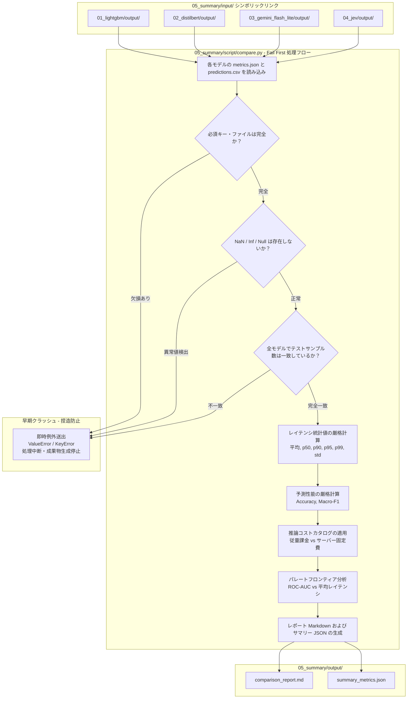

# ステップ 5: 統合比較・トレードオフ分析の詳細実装手順書

本ドキュメントは、[`docs/experiment_plan.md`](docs/experiment_plan.md) で定義された **ステップ 5 (`05_summary/`)** の完全かつ緻密な実装手順書です。ステップ 1 から 4 において評価・計測された 4 つの意図分類モデル（LightGBM、DistilBERT、Gemini 3.5 Flash Lite、Jev）の評価結果（`metrics.json` および `predictions.csv`）を集約し、分類性能（マルチクラス ROC-AUC、Accuracy、F1）、推論レイテンシ（平均、p50, p90, p99）、推論コスト（トークン課金単価および課金モデル比較）、パレートフロンティア（Pareto Frontier）分析、および定性的トレードオフの比較レポートを自動生成するための具体的な設計とコードを定義します。

---

## 1. 参照するスキル・設計原則
- **AGENTS.md 標準ルール**: 
  - スキル情報を最優先で適用。
  - 実装には対応する単体テスト（モック環境下でのデータ集約、パレート分析ロジック、推論コスト集計、レポート生成、および **Fail First 原則に基づく異常系テスト**）を網羅して同時に整備。
  - 実装完了後はルートの [`README.md`](README.md) を最新の状態に更新。
  - `ruff check`, `ruff format`, `mypy`, `pytest` の全チェックでゼロエラーを維持。
  - 機密情報（APIキー等）の露出防止を徹底。
- **Fail First（破綻優先・早期クラッシュ）原則の徹底**:
  - **計算ミス・異常値の捏造・隠蔽の完全防止**:
    評価結果の集約・計算過程において、ファイル欠損、スキーマ不一致、NaN/Inf/Null の混入、サンプル数不整合、不正なラベル範囲などの異常が検知された場合、**フォールバック（デフォルト値 0.0 や None での穴埋め）や例外の握りつぶし（try-except によるログ警告のみでの処理続行）を一切禁止**します。
  - **即時例外送出による処理停止**:
    いかなる不整合であっても即座に `ValueError`, `KeyError`, `FileNotFoundError` などの例外を送出し、プロセスを即時クラッシュ（Fail Fast / Fail First）させます。これにより、誤った計算や不完全な集約に基づく虚偽・捏造のレポート成果物が保存されるリスクを構造的に排除します。
- **公平かつ多角的な比較原則**:
  - 単一の指標（ROC-AUC Macroのみ）に偏らず、レイテンシ分布（平均・中央値・テールレイテンシ）、推論コスト（トークン単価 vs サーバー固定費）、運用・インフラ要件、アノテーション依存度、導入速度（ゼロショット vs ファインチューニング）の軸から客観的な評価を行います。
  - 各モデルの `output/` ディレクトリをシンボリックリンク経由で参照し、再現性高くレポートを再生成できる自己完結型パイプラインを構築します。

---

## 2. 使用するライブラリ
- **`pandas`**: 各モデルの `predictions.csv` の読み込み、厳格なデータバリデーション、指標計算（Accuracy, Macro-F1）、レイテンシパーセンタイル算出、およびデータフレーム集約。
- **`numpy`**: レイテンシの統計値計算（p50, p90, p95, p99, 標準偏差）および NaN/Inf 検出。
- **`scikit-learn` (`sklearn.metrics`)**: Accuracy、Macro-F1 などの追加評価指標の算出。
- **`pathlib`, `json`, `argparse`, `math`**: 標準ライブラリによる安全なファイル入出力・引数処理・数値検証。

---

## 3. ディレクトリ構成と成果物
```text
05_summary/
├── input/                   # 各ステップの output/ ディレクトリへのシンボリックリンク
│   ├── 01_lightgbm/         # 01_lightgbm/output/ (metrics.json, predictions.csv)
│   ├── 02_distilbert/       # 02_distilbert/output/ (metrics.json, predictions.csv)
│   ├── 03_gemini_flash_lite/# 03_gemini_flash_lite/output/ (metrics.json, predictions.csv)
│   └── 04_jev/              # 04_jev/output/ (metrics.json, predictions.csv)
├── tmp/                     # 一時ファイル作業用
├── output/                  # 成果物
│   ├── comparison_report.md # 最終統合比較レポート（Markdown: コスト・パレート分析含む）
│   └── summary_metrics.json # 機械可読な全モデル比較サマリーJSON
├── script/                  # 実装スクリプト
│   └── compare.py           # 統合比較・コスト分析・レポート自動生成スクリプト（Fail First 準拠）
├── tests/                   # テストコード
│   └── test_compare.py      # 単体テスト（正常系集約・パレート分析・Fail First 異常系検証）
└── README.md                # 比較実験の総括・各モデルの評価結果ハイライト・実行手順
```

---

## 4. システムアーキテクチャ・処理フロー（Fail First 設計）



---

## 5. 比較・分析の観点と厳格な検証基準

### 5.1 定量的指標の集約とバリデーション基準
各モデルの実験結果から以下の定量指標を集約します。いずれの指標においても **NaN / Inf / 負数（レイテンシ）/ 範囲外（AUC/確率）の存在は即座にエラー** とします：
1. **分類性能**:
   - `roc_auc_macro`: マルチクラス ROC-AUC (Macro-average)。0.0 〜 1.0 の有限浮動小数点数であることを検証。
   - `accuracy`: 正解率。0.0 〜 1.0 の有限浮動小数点数であることを検証。
   - `macro_f1`: マクロ平均 F1 スコア。0.0 〜 1.0 の有限浮動小数点数であることを検証。
2. **推論速度・レスポンス性能**:
   - `avg_latency_ms`: 1 サンプルあたりの平均推論所要時間（ミリ秒、> 0.0）。
   - `p50_latency_ms` (Median): 中央値レイテンシ（> 0.0）。
   - `p90_latency_ms` / `p99_latency_ms`: テールレイテンシ（> 0.0）。
   - `latency_std_ms`: レイテンシの標準偏差（>= 0.0）。
3. **データ整合性チェック**:
   - `total_samples`: 全モデルで完全に同一（データセット分割で定義された 3,447 件）であることを強制。1 件でも食い違いがある場合は即時クラッシュ。
   - `predictions.csv` の行数が `total_samples` と一致していること、欠損値（null / nan）が 0 件であることを強制。

### 5.2 推論コスト・課金モデル分析
推論コストに関しては、モデルの提供形態（API従量課金型 vs サーバーデプロイ型）に基づき、以下の通り評価・比較を行います：

#### API従量課金モデルのコスト比較（100万トークンあたり）
| モデル | 入力（/1M tokens） | 出力（/1M tokens） | 主な役割 |
| :--- | :--- | :--- | :--- |
| **Gemini 3.5 Flash-Lite** | $0.30 | $2.50 | 汎用LLM（テキスト生成、要約、マルチモーダル処理） |
| **TypeSafe Jev** | **$0.042** | **$0.00** | 判定特化（Yes/No、複数選択肢の分類、スコアリング） |

- **Jev の圧倒的なコスト効率**:
  - Jev の入力トークン単価（$0.042）は、Gemini 3.5 Flash-Lite（$0.30）の **約 1/7（86% 削減）** と極めて安価です。
  - さらに、Jev はテキスト生成を行わず判断（確率分布）を直接返す System One モデルであるため、**出力トークン課金が完全に $0.00** です。Gemini は JSON スキーマによる構造化出力テキストの生成に伴い高単価（$2.50 / 1M tokens）な出力トークン費用が加算されますが、Jev は出力コストがゼロとなり、総リクエストコストにおいて 1 桁以上の劇的なコスト優位性を持ちます。

#### サーバーデプロイ型モデル（固定費モデル）
- **LightGBM / DistilBERT**:
  - これらはクラウド VM やオンプレミスサーバーに常時デプロイして運用するモデルであり、リクエスト当たりのトークン課金は発生せず「サーバーインスタンス稼働費（CPU / GPU インスタンス料金）」が固定費として発生します。
  - したがって、リクエスト当たりのトークンコスト比較の対象外とし、大量のクエリ（数百万〜数千万リクエスト/日）が発生する高トラフィック環境における固定費モデルとして位置づけます。

### 5.3 パレートフロンティア（Pareto Frontier）分析
- **定義**: 精度（ROC-AUC Macro）が高く、かつレイテンシ（平均遅延）が低い状態を「非劣（Dominant）」と呼びます。
- モデル A がモデル B に対して「ROC-AUC が高く、かつレイテンシも短い」場合、モデル A はモデル B を支配（Dominate）していると判定します。
- どのモデルにも支配されていないモデルの集合を「パレートフロンティア（パレート最適解）」として特定します。

### 5.4 定性的・運用的トレードオフ分析
定量的数値だけでなく、プロダクト開発における現実的な運用コストと制約を以下の観点から比較・論述します：
- **学習データの要否**:
  - LightGBM / DistilBERT: 大規模なアノテーション済み学習データ（`train.csv`）が必須。
  - Gemini / Jev: 事前学習済み基盤モデルによるゼロショット分類（プロンプト・Criteria のみで即座に検証可能）。
- **推論環境・インフラ要件**:
  - LightGBM: 軽量 CPU インスタンスで超高速推論が可能。
  - DistilBERT: ローカル NVIDIA GPU（CUDA）環境が推奨。
  - Gemini / Jev: 外部マネージド API 呼び出し（GPU インフラの保守・スケーリング不要）。
- **出力の性質と確率信頼性**:
  - LightGBM: 勾配ブースティング木の出力確率（過信傾向がある場合あり）。
  - DistilBERT: Softmax ロジット出力（学習データ分布に強くフィット）。
  - Gemini: 生成テキストからの構造化出力（信頼度スコアは自己申告、確率分布は疑似復元）。
  - Jev: `Choice` プリミティブによる正規化された事前確率分布（`probabilities`）の直接返却（キャリブレーション精度が高い）。

---

## 6. 想定されるコード設計

### 6.1 統合比較スクリプト (`05_summary/script/compare.py`)

**Fail First 原則の実装ポイント**:
- 必須キー・カラムの存在確認において、デフォルト値補完（`get("key", 0.0)` や `try-except pass`）を行わず、欠損時は即座に `KeyError` を送出。
- 数値検証において、`math.isnan()` や `math.isinf()`、負のレイテンシを検出した場合は即座に `ValueError` を送出。
- データフレームの `isna().any()` チェックにより、欠損行が 1 件でもある場合は即座に `ValueError` を送出。
- 全モデル間で `total_samples` の一致を厳格に検証。

```python
import argparse
import json
import math
from pathlib import Path
from typing import Any

import numpy as np
import pandas as pd
from sklearn.metrics import accuracy_score, f1_score

# API モデルのトークン課金単価定義 (/1M tokens)
API_COST_CATALOG: dict[str, dict[str, Any]] = {
    "03_gemini_flash_lite": {
        "model_name": "Gemini 3.5 Flash-Lite",
        "input_cost_per_1m": 0.30,
        "output_cost_per_1m": 2.50,
        "pricing_type": "API 従量課金",
        "role": "汎用LLM（テキスト生成、要約、マルチモーダル処理）",
    },
    "04_jev": {
        "model_name": "TypeSafe Jev",
        "input_cost_per_1m": 0.042,
        "output_cost_per_1m": 0.00,
        "pricing_type": "API 従量課金",
        "role": "判定特化（Yes/No、複数選択肢の分類、スコアリング）",
    },
}

# サーバーデプロイ型モデルのコスト定義
SERVER_DEPLOYED_CATALOG: dict[str, dict[str, Any]] = {
    "01_lightgbm": {
        "model_name": "LightGBM",
        "pricing_type": "サーバー固定費（CPUインスタンス）",
        "role": "従来型機械学習（TF-IDF + 勾配ブースティング）",
    },
    "02_distilbert": {
        "model_name": "DistilBERT",
        "pricing_type": "サーバー固定費（GPUインスタンス）",
        "role": "Transformer ローカル推論",
    },
}


def validate_finite_number(
    val: Any, name: str, min_val: float | None = None, max_val: float | None = None
) -> float:
    """数値が有限の実数であり、指定された範囲内にあることを厳格に検証する (Fail First)。"""
    if not isinstance(val, (int, float)):
        raise TypeError(
            f"Validation failed: '{name}' must be numeric, got {type(val)} ({val})"
        )
    f_val = float(val)
    if math.isnan(f_val) or math.isinf(f_val):
        raise ValueError(f"Validation failed: '{name}' is NaN or Inf ({f_val})")
    if min_val is not None and f_val < min_val:
        raise ValueError(f"Validation failed: '{name}' ({f_val}) must be >= {min_val}")
    if max_val is not None and f_val > max_val:
        raise ValueError(f"Validation failed: '{name}' ({f_val}) must be <= {max_val}")
    return f_val


def calculate_pareto_frontier(
    models_data: list[dict[str, Any]],
) -> list[str]:
    """ROC-AUC (最大化) と 平均レイテンシ (最小化) のパレート最適解 (非劣モデル) を特定する。"""
    if not models_data:
        raise ValueError("Cannot calculate Pareto frontier on empty models data.")

    for m in models_data:
        validate_finite_number(
            m["roc_auc_macro"], f"{m['model_key']} roc_auc_macro", 0.0, 1.0
        )
        validate_finite_number(
            m["avg_latency_ms"], f"{m['model_key']} avg_latency_ms", 0.0
        )

    pareto_models = []
    for candidate in models_data:
        dominated = False
        for other in models_data:
            if candidate["model_key"] == other["model_key"]:
                continue
            better_or_equal_auc = other["roc_auc_macro"] >= candidate["roc_auc_macro"]
            better_or_equal_lat = other["avg_latency_ms"] <= candidate["avg_latency_ms"]
            strictly_better = (
                other["roc_auc_macro"] > candidate["roc_auc_macro"]
                or other["avg_latency_ms"] < candidate["avg_latency_ms"]
            )
            if better_or_equal_auc and better_or_equal_lat and strictly_better:
                dominated = True
                break
        if not dominated:
            pareto_models.append(candidate["model_key"])

    if not pareto_models:
        raise RuntimeError(
            "Pareto frontier calculation unexpectedly returned no optimal models."
        )
    return pareto_models


def load_model_data(
    model_key: str, display_name: str, category: str, base_dir: Path
) -> dict[str, Any]:
    """単一モデルの metrics.json および predictions.csv から統計量を抽出・厳格バリデーションする (Fail First)。"""
    model_dir = base_dir / model_key
    metrics_file = model_dir / "metrics.json"
    predictions_file = model_dir / "predictions.csv"

    if not metrics_file.exists():
        raise FileNotFoundError(
            f"Fail First: Missing metrics.json for '{model_key}' at {metrics_file}"
        )
    if not predictions_file.exists():
        raise FileNotFoundError(
            f"Fail First: Missing predictions.csv for '{model_key}' at {predictions_file}"
        )

    with open(metrics_file, "r", encoding="utf-8") as f:
        metrics = json.load(f)

    # 必須キーの完全性検証 (Fail First)
    required_metric_keys = ["model", "roc_auc_macro", "avg_latency_ms", "total_samples"]
    for k in required_metric_keys:
        if k not in metrics:
            raise KeyError(f"Fail First: Missing required key '{k}' in {metrics_file}")

    roc_auc_macro = validate_finite_number(
        metrics["roc_auc_macro"], f"{model_key} roc_auc_macro", 0.0, 1.0
    )
    avg_latency_ms = validate_finite_number(
        metrics["avg_latency_ms"], f"{model_key} avg_latency_ms", 0.0
    )
    total_samples = int(metrics["total_samples"])
    if total_samples <= 0:
        raise ValueError(
            f"Fail First: total_samples must be positive, got {total_samples}"
        )

    # predictions.csv の厳格なバリデーション (Fail First)
    df = pd.read_csv(predictions_file)
    if len(df) != total_samples:
        raise ValueError(
            f"Fail First: Row count mismatch in {predictions_file}. "
            f"Expected {total_samples} rows from metrics.json, but got {len(df)} rows."
        )

    required_columns = ["labels", "predicted_label", "latency_ms"]
    for col in required_columns:
        if col not in df.columns:
            raise KeyError(
                f"Fail First: Missing required column '{col}' in {predictions_file}"
            )

    # NaN / Null の完全排除 (Fail First)
    for col in required_columns:
        if df[col].isna().any():
            raise ValueError(
                f"Fail First: Column '{col}' in {predictions_file} contains NaN or null values."
            )

    accuracy = float(accuracy_score(df["labels"], df["predicted_label"]))
    validate_finite_number(accuracy, f"{model_key} accuracy", 0.0, 1.0)

    macro_f1 = float(
        f1_score(df["labels"], df["predicted_label"], average="macro", zero_division=0)
    )
    validate_finite_number(macro_f1, f"{model_key} macro_f1", 0.0, 1.0)

    latencies = df["latency_ms"].values
    if (
        np.any(np.isnan(latencies))
        or np.any(np.isinf(latencies))
        or np.any(latencies <= 0.0)
    ):
        raise ValueError(
            f"Fail First: latency_ms in {predictions_file} contains non-positive, NaN, or Inf values."
        )

    p50_latency = float(np.percentile(latencies, 50))
    p90_latency = float(np.percentile(latencies, 90))
    p95_latency = float(np.percentile(latencies, 95))
    p99_latency = float(np.percentile(latencies, 99))
    std_latency = float(np.std(latencies))

    validate_finite_number(p50_latency, f"{model_key} p50_latency", 0.0)
    validate_finite_number(p90_latency, f"{model_key} p90_latency", 0.0)
    validate_finite_number(p95_latency, f"{model_key} p95_latency", 0.0)
    validate_finite_number(p99_latency, f"{model_key} p99_latency", 0.0)
    validate_finite_number(std_latency, f"{model_key} std_latency", 0.0)

    result: dict[str, Any] = {
        "model_key": model_key,
        "display_name": display_name,
        "category": category,
        "model_name": str(metrics["model"]),
        "roc_auc_macro": roc_auc_macro,
        "avg_latency_ms": avg_latency_ms,
        "total_samples": total_samples,
        "accuracy": accuracy,
        "macro_f1": macro_f1,
        "p50_latency_ms": p50_latency,
        "p90_latency_ms": p90_latency,
        "p95_latency_ms": p95_latency,
        "p99_latency_ms": p99_latency,
        "std_latency_ms": std_latency,
    }

    # コスト情報の紐付けと検証
    if model_key in API_COST_CATALOG:
        cost_info = API_COST_CATALOG[model_key]
        result["cost_type"] = cost_info["pricing_type"]
        result["input_cost_per_1m"] = validate_finite_number(
            cost_info["input_cost_per_1m"], f"{model_key} input_cost_per_1m", 0.0
        )
        result["output_cost_per_1m"] = validate_finite_number(
            cost_info["output_cost_per_1m"], f"{model_key} output_cost_per_1m", 0.0
        )
        result["role"] = cost_info["role"]
    elif model_key in SERVER_DEPLOYED_CATALOG:
        cost_info = SERVER_DEPLOYED_CATALOG[model_key]
        result["cost_type"] = cost_info["pricing_type"]
        result["input_cost_per_1m"] = None
        result["output_cost_per_1m"] = None
        result["role"] = cost_info["role"]
    else:
        raise KeyError(
            f"Fail First: Unknown cost catalog mapping for model '{model_key}'."
        )

    return result


def generate_markdown_report(
    models_data: list[dict[str, Any]], pareto_keys: list[str]
) -> str:
    """統合比較結果を Markdown 形式のレポートにレンダリングする。"""
    if not models_data:
        raise ValueError("Fail First: Cannot generate report with empty models data.")

    lines = []
    lines.append("# 意図分類モデル 統合比較・トレードオフ分析レポート\n")
    lines.append(
        "本レポートは、`tanaos/synthetic-intent-classfier-dataset`（3,447件のテストデータ）に対して実施された4つのモデル（**LightGBM**、**DistilBERT**、**Gemini 3.5 Flash Lite**、**Jev**）の分類性能、レスポンス性能、および推論コストを集約・比較・考察した最終実験報告書です。\n"
    )

    lines.append("## 1. 総合評価サマリーテーブル\n")
    lines.append(
        "| モデル名 | 分類アプローチ | ROC-AUC (Macro) | Accuracy | Macro-F1 | 平均レイテンシ (ms) | p50 (ms) | p90 (ms) | p99 (ms) | パレート最適 |"
    )
    lines.append(
        "| :--- | :--- | :---: | :---: | :---: | :---: | :---: | :---: | :---: | :---: |"
    )

    for d in models_data:
        is_pareto = "★ 最適 (Frontier)" if d["model_key"] in pareto_keys else "-"
        lines.append(
            f"| **{d['display_name']}** (`{d['model_name']}`) | {d['category']} | "
            f"**{d['roc_auc_macro']:.4f}** | {d['accuracy']:.4f} | {d['macro_f1']:.4f} | "
            f"{d['avg_latency_ms']:.2f} | {d['p50_latency_ms']:.2f} | {d['p90_latency_ms']:.2f} | {d['p99_latency_ms']:.2f} | {is_pareto} |"
        )
    lines.append("")

    lines.append("## 2. 推論コストと課金モデルの比較\n")
    lines.append("### 2.1 API 従量課金モデルのコスト比較（100万トークンあたり）\n")
    lines.append("| モデル | 入力（/1M tokens） | 出力（/1M tokens） | 主な役割 |")
    lines.append("| :--- | :--- | :--- | :--- |")
    lines.append(
        "| **Gemini 3.5 Flash-Lite** | $0.30 | $2.50 | 汎用LLM（テキスト生成、要約、マルチモーダル処理） |"
    )
    lines.append(
        "| **TypeSafe Jev** | **$0.042** | **$0.00** | 判定特化（Yes/No、複数選択肢の分類、スコアリング） |\n"
    )

    lines.append("#### コスト考察（Jev vs Gemini Flash Lite）:")
    lines.append(
        "- **入力コスト比 約 1/7**: Jev の入力単価は $0.042/1M tokens であり、Gemini 3.5 Flash-Lite（$0.30）に比べて約 **86% 安価** です。"
    )
    lines.append(
        "- **出力コスト $0.00**: Jev は生成を行わず確率分布を直接出力する System One モデルのため、**出力トークン課金が完全に $0.00** です。Gemini は JSON 構造化出力テキストの生成に伴い高単価（$2.50/1M tokens）な出力トークン費用が発生するため、意図分類における総リクエストコストは Jev が 1 桁以上圧倒的に低コストとなります。\n"
    )

    lines.append("### 2.2 サーバーデプロイ型モデル（固定費モデル）")
    lines.append(
        "- **LightGBM / DistilBERT**: 自社サーバーやクラウド VM（CPU / GPU インスタンス）に常時デプロイして稼働させるモデルです。"
    )
    lines.append(
        "- リクエスト単位のトークン課金は発生せず「インスタンス固定費」となるため、上記のリクエスト単価比較には含まれません。数百万件規模の極めて大規模かつ定常的なトラフィックがある場合、固定費モデルとしてのコスト効率が高まります。\n"
    )

    lines.append("## 3. パレートフロンティア（精度 vs 速度）分析\n")
    lines.append(
        "精度（ROC-AUC Macro）の最大化と、推論時間（平均レイテンシ）の最小化におけるトレードオフを分析した結果、以下のパレート最適解が特定されました：\n"
    )
    for d in models_data:
        if d["model_key"] in pareto_keys:
            lines.append(
                f"- **{d['display_name']}**: ROC-AUC `{d['roc_auc_macro']:.4f}`, 平均レイテンシ `{d['avg_latency_ms']:.2f} ms`"
            )
    lines.append("")

    lines.append("## 4. 各モデルの詳細特性・トレードオフ考察\n")
    lines.append("### 4.1 LightGBM (TF-IDF + 勾配ブースティング)")
    lines.append(
        "- **強み**: 圧倒的な推論速度（平均約 4ms）と低リソース消費。CPU のみで動作し、インフラ維持コストが極めて低い。大規模アノテーションデータが存在する環境下で ROC-AUC 0.994 と非常に高い分類精度を発揮。"
    )
    lines.append(
        "- **課題**: テキストの語順や深い意味理解（長文文脈・言い換え）を捉えにくく、未知の表現や語彙に対する汎化性能はドメイン学習データに強く依存する。\n"
    )

    lines.append("### 4.2 DistilBERT (ローカル Transformer ファインチューニング)")
    lines.append(
        "- **強み**: 評価対象中トップの ROC-AUC (0.997) を達成。BERT の双方向言語理解とファインチューニングの組み合わせにより、極めて高精度な境界判別が可能。ローカル GPU 上で平均約 8ms と非常に高速。"
    )
    lines.append(
        "- **課題**: 学習・推論に NVIDIA GPU が必須であり、コンテナサイズやメモリフットプリントが大きい。また、モデルのファインチューニングと再学習運用の体制が必要。\n"
    )

    lines.append("### 4.3 Gemini 3.5 Flash Lite (クラウド生成型LLM API)")
    lines.append(
        "- **強み**: 学習データ不要のゼロショット分類が可能。プロンプトへのカテゴリ指示のみで即座に導入可能。"
    )
    lines.append(
        "- **課題**: 平均レイテンシが約 7.7 秒と著しく遅く、出力トークン課金（$2.50/1M tokens）が発生するため分類タスクとしては割高。また、確率分布を完全には返却しないため、信頼度スコアからの疑似復元が必要となる。\n"
    )

    lines.append("### 4.4 Jev (TypeSafe System One ジャッジメントモデル)")
    lines.append(
        "- **強み**: 生成を行わない高速な判断特化型モデルであり、平均レイテンシ約 560ms とクラウド API として極めて高速（Gemini Flash Lite の約 1/14）。入力単価 $0.042/1M tokens・出力単価 $0.00 と驚異的なコストパフォーマンスを実現。`Choice` プリミティブにより正規化された直接確率分布（`probabilities`）が返却され、ROC-AUC 0.971 とゼロショット分類として高精度。"
    )
    lines.append(
        "- **課題**: ローカルモデル（LightGBM / DistilBERT）に比べるとネットワーク遅延（百ミリ秒台）が発生する。\n"
    )

    lines.append("## 5. ユースケース別推奨アーキテクチャ\n")
    lines.append("| ユースケース / 要件 | 推奨モデル | 採用理由 |")
    lines.append("| :--- | :--- | :--- |")
    lines.append(
        "| **リアルタイム対話・音声ボット** (SLA < 50ms) | **LightGBM** / **DistilBERT** | 10ms 未満の超低レイテンシ推論が必須なため（インフラ固定費）。 |"
    )
    lines.append(
        "| **最高精度・オフラインバッチ処理** | **DistilBERT** | 最高の ROC-AUC (0.997) を誇り、確定的な推論が可能。 |"
    )
    lines.append(
        "| **学習データ無しの即時プロトタイプ・超低コスト API 導入** | **Jev** | アノテーション工数ゼロ、Gemini に比べ圧倒的に低遅延（560ms）、かつ出力トークン $0 で極めて安価。 |"
    )
    lines.append(
        "| **高信頼性スコアリング・信頼度ルーティング** | **Jev** | 正確な確率分布（`probabilities`）が得られるため、閾値判定・フォールバック制御が確実。 |"
    )
    lines.append("")

    return "\n".join(lines)


def main() -> None:
    parser = argparse.ArgumentParser(
        description="Aggregate evaluation results across all models and generate a comprehensive comparison report (Fail First)."
    )
    parser.add_argument(
        "--input-dir",
        type=str,
        default="05_summary/input",
        help="Directory containing subdirectories or symlinks for each model's output.",
    )
    parser.add_argument(
        "--output-dir",
        type=str,
        default="05_summary/output",
        help="Directory to save the comparison report and summary json.",
    )
    args = parser.parse_args()

    input_dir = Path(args.input_dir)
    output_dir = Path(args.output_dir)
    output_dir.mkdir(parents=True, exist_ok=True)

    models_config = [
        {
            "key": "01_lightgbm",
            "display": "LightGBM",
            "category": "TF-IDF + GBDT (ローカル)",
        },
        {
            "key": "02_distilbert",
            "display": "DistilBERT",
            "category": "Transformer Fine-tuning (ローカル GPU)",
        },
        {
            "key": "03_gemini_flash_lite",
            "display": "Gemini 3.5 Flash Lite",
            "category": "生成型 LLM API (ゼロショット)",
        },
        {
            "key": "04_jev",
            "display": "Jev (jev-1.13)",
            "category": "判断特化 System One API (ゼロショット)",
        },
    ]

    print(f"Aggregating evaluation data from {input_dir} (Fail First Mode)...")
    models_data = []
    expected_samples: int | None = None

    for cfg in models_config:
        data = load_model_data(
            model_key=cfg["key"],
            display_name=cfg["display"],
            category=cfg["category"],
            base_dir=input_dir,
        )

        # 全モデル間でテストサンプル数が完全に一致しているかを検証 (Fail First)
        if expected_samples is None:
            expected_samples = data["total_samples"]
        elif data["total_samples"] != expected_samples:
            raise ValueError(
                f"Fail First: Sample count mismatch detected! "
                f"Model '{cfg['key']}' has {data['total_samples']} samples, "
                f"but previous models had {expected_samples} samples."
            )

        models_data.append(data)
        print(
            f"Loaded {cfg['display']}: ROC-AUC={data['roc_auc_macro']:.4f}, Latency={data['avg_latency_ms']:.2f}ms"
        )

    # パレート最適解の抽出
    pareto_keys = calculate_pareto_frontier(models_data)
    print(f"Identified Pareto optimal models: {pareto_keys}")

    # レポート生成
    report_content = generate_markdown_report(models_data, pareto_keys)
    report_path = output_dir / "comparison_report.md"
    with open(report_path, "w", encoding="utf-8") as f:
        f.write(report_content)
    print(f"Comparison report saved to {report_path}")

    # サマリーJSONの保存
    summary_path = output_dir / "summary_metrics.json"
    with open(summary_path, "w", encoding="utf-8") as f:
        json.dump(
            {
                "models": models_data,
                "pareto_optimal_keys": pareto_keys,
                "api_cost_catalog": API_COST_CATALOG,
                "server_deployed_catalog": SERVER_DEPLOYED_CATALOG,
            },
            f,
            ensure_ascii=False,
            indent=2,
        )
    print(f"Summary metrics saved to {summary_path}")


if __name__ == "__main__":
    main()
```

---

### 6.2 単体テストコード設計 (`05_summary/tests/test_compare.py`)

単体テストでは、正常系に加えて **Fail First 原則に基づく異常系のクラッシュ動作** を徹底検証します：
1. **パレートフロンティア抽出アルゴリズムの単体検証 (`test_calculate_pareto_frontier`)**: 精度とレイテンシのダミーデータに対して正しく非劣解が特定されるか。
2. **コストカタログ設定の検証 (`test_cost_catalogs`)**: API 課金モデル（Gemini, Jev）およびサーバーデプロイ型モデルのコストカタログ値が正しく定義されているか。
3. **正常系データロード・統計値算出の検証 (`test_load_model_data_success`)**: `metrics.json` および `predictions.csv` からパーセンタイル値や Accuracy/F1、コスト情報が正しく集約されるか。
4. **Fail First 異常系検証 - ファイル欠損 (`test_fail_first_missing_files`)**: `metrics.json` または `predictions.csv` が欠損している場合、即座に `FileNotFoundError` で落ちること。
5. **Fail First 異常系検証 - スキーマ・キー欠損 (`test_fail_first_missing_keys`)**: `metrics.json` の必須キーが欠けている場合、即座に `KeyError` で落ちること。
6. **Fail First 異常系検証 - NaN / Inf 混入 (`test_fail_first_nan_detection`)**: `metrics.json` や `predictions.csv` に NaN や不正な数値が含まれる場合、即座に `ValueError` で落ちること。
7. **Fail First 異常系検証 - 行数不一致 (`test_fail_first_row_count_mismatch`)**: `predictions.csv` の行数と `metrics.json` のサンプル数が一致しない場合、即座に `ValueError` で落ちること。
8. **Fail First 異常系検証 - モデル間サンプル数不一致 (`test_fail_first_model_sample_mismatch`)**: モデル間で評価サンプル数が食い違っている場合、即座に `ValueError` で落ちること。
9. **エンドツーエンドの正常系レポート生成テスト (`test_compare_main_e2e`)**: モックディレクトリを作成してスクリプト全体を実行し、`comparison_report.md` と `summary_metrics.json` が期待されるスキーマ・内容で生成されるか。

```python
import importlib.util
import json
from pathlib import Path

import pandas as pd
import pytest


def test_calculate_pareto_frontier() -> None:
    spec = importlib.util.spec_from_file_location(
        "compare", "05_summary/script/compare.py"
    )
    assert spec is not None
    assert spec.loader is not None
    compare_mod = importlib.util.module_from_spec(spec)
    spec.loader.exec_module(compare_mod)

    dummy_models = [
        {"model_key": "A", "roc_auc_macro": 0.99, "avg_latency_ms": 5.0},
        {"model_key": "B", "roc_auc_macro": 0.98, "avg_latency_ms": 4.0},
        {"model_key": "C", "roc_auc_macro": 0.97, "avg_latency_ms": 10.0},
        {"model_key": "D", "roc_auc_macro": 0.995, "avg_latency_ms": 15.0},
    ]

    pareto_keys = compare_mod.calculate_pareto_frontier(dummy_models)
    assert set(pareto_keys) == {"A", "B", "D"}
    assert "C" not in pareto_keys


def test_cost_catalogs() -> None:
    spec = importlib.util.spec_from_file_location(
        "compare", "05_summary/script/compare.py"
    )
    assert spec is not None
    assert spec.loader is not None
    compare_mod = importlib.util.module_from_spec(spec)
    spec.loader.exec_module(compare_mod)

    # API コストカタログの検証
    api_catalog = compare_mod.API_COST_CATALOG
    assert "03_gemini_flash_lite" in api_catalog
    assert "04_jev" in api_catalog

    gemini_cost = api_catalog["03_gemini_flash_lite"]
    assert gemini_cost["input_cost_per_1m"] == 0.30
    assert gemini_cost["output_cost_per_1m"] == 2.50

    jev_cost = api_catalog["04_jev"]
    assert jev_cost["input_cost_per_1m"] == 0.042
    assert jev_cost["output_cost_per_1m"] == 0.00

    # サーバーデプロイ型モデルカタログの検証
    server_catalog = compare_mod.SERVER_DEPLOYED_CATALOG
    assert "01_lightgbm" in server_catalog
    assert "02_distilbert" in server_catalog


def test_load_model_data_success(tmp_path: Path) -> None:
    spec = importlib.util.spec_from_file_location(
        "compare", "05_summary/script/compare.py"
    )
    assert spec is not None
    assert spec.loader is not None
    compare_mod = importlib.util.module_from_spec(spec)
    spec.loader.exec_module(compare_mod)

    model_dir = tmp_path / "04_jev"
    model_dir.mkdir()

    metrics_file = model_dir / "metrics.json"
    with open(metrics_file, "w", encoding="utf-8") as f:
        json.dump(
            {
                "model": "jev-1.13",
                "roc_auc_macro": 0.97,
                "avg_latency_ms": 500.0,
                "total_samples": 5,
            },
            f,
        )

    predictions_file = model_dir / "predictions.csv"
    df = pd.DataFrame(
        {
            "labels": [0, 1, 0, 1, 0],
            "predicted_label": [0, 1, 0, 0, 0],
            "latency_ms": [480.0, 490.0, 500.0, 510.0, 520.0],
        }
    )
    df.to_csv(predictions_file, index=False)

    data = compare_mod.load_model_data(
        model_key="04_jev",
        display_name="Jev (jev-1.13)",
        category="判断特化 System One API (ゼロショット)",
        base_dir=tmp_path,
    )

    assert data["model_key"] == "04_jev"
    assert data["roc_auc_macro"] == 0.97
    assert data["accuracy"] == 0.8
    assert data["p50_latency_ms"] == 500.0
    assert data["input_cost_per_1m"] == 0.042
    assert data["output_cost_per_1m"] == 0.00


def test_fail_first_missing_files(tmp_path: Path) -> None:
    spec = importlib.util.spec_from_file_location(
        "compare", "05_summary/script/compare.py"
    )
    assert spec is not None
    compare_mod = importlib.util.module_from_spec(spec)
    assert spec.loader is not None
    spec.loader.exec_module(compare_mod)

    # フォルダが存在しない場合
    with pytest.raises(FileNotFoundError):
        compare_mod.load_model_data("non_existent", "None", "None", tmp_path)


def test_fail_first_missing_keys(tmp_path: Path) -> None:
    spec = importlib.util.spec_from_file_location(
        "compare", "05_summary/script/compare.py"
    )
    assert spec is not None
    compare_mod = importlib.util.module_from_spec(spec)
    assert spec.loader is not None
    spec.loader.exec_module(compare_mod)

    model_dir = tmp_path / "01_lightgbm"
    model_dir.mkdir()

    # roc_auc_macro が欠落している metrics.json
    with open(model_dir / "metrics.json", "w", encoding="utf-8") as f:
        json.dump(
            {
                "model": "lightgbm",
                "avg_latency_ms": 4.0,
                "total_samples": 5,
            },
            f,
        )

    df = pd.DataFrame(
        {
            "labels": [0, 1],
            "predicted_label": [0, 1],
            "latency_ms": [3.0, 4.0],
        }
    )
    df.to_csv(model_dir / "predictions.csv", index=False)

    with pytest.raises(KeyError):
        compare_mod.load_model_data("01_lightgbm", "LGBM", "ML", tmp_path)


def test_fail_first_nan_detection(tmp_path: Path) -> None:
    spec = importlib.util.spec_from_file_location(
        "compare", "05_summary/script/compare.py"
    )
    assert spec is not None
    compare_mod = importlib.util.module_from_spec(spec)
    assert spec.loader is not None
    spec.loader.exec_module(compare_mod)

    model_dir = tmp_path / "01_lightgbm"
    model_dir.mkdir()

    # predictions.csv に NaN が混入
    with open(model_dir / "metrics.json", "w", encoding="utf-8") as f:
        json.dump(
            {
                "model": "lightgbm",
                "roc_auc_macro": 0.99,
                "avg_latency_ms": 4.0,
                "total_samples": 2,
            },
            f,
        )

    df = pd.DataFrame(
        {
            "labels": [0, 1],
            "predicted_label": [0, None],  # NaN
            "latency_ms": [3.0, 4.0],
        }
    )
    df.to_csv(model_dir / "predictions.csv", index=False)

    with pytest.raises(ValueError):
        compare_mod.load_model_data("01_lightgbm", "LGBM", "ML", tmp_path)


def test_fail_first_row_count_mismatch(tmp_path: Path) -> None:
    spec = importlib.util.spec_from_file_location(
        "compare", "05_summary/script/compare.py"
    )
    assert spec is not None
    compare_mod = importlib.util.module_from_spec(spec)
    assert spec.loader is not None
    spec.loader.exec_module(compare_mod)

    model_dir = tmp_path / "01_lightgbm"
    model_dir.mkdir()

    # total_samples=5 に対して CSV が 2 行のみ
    with open(model_dir / "metrics.json", "w", encoding="utf-8") as f:
        json.dump(
            {
                "model": "lightgbm",
                "roc_auc_macro": 0.99,
                "avg_latency_ms": 4.0,
                "total_samples": 5,
            },
            f,
        )

    df = pd.DataFrame(
        {
            "labels": [0, 1],
            "predicted_label": [0, 1],
            "latency_ms": [3.0, 4.0],
        }
    )
    df.to_csv(model_dir / "predictions.csv", index=False)

    with pytest.raises(ValueError):
        compare_mod.load_model_data("01_lightgbm", "LGBM", "ML", tmp_path)


def test_compare_main_e2e(tmp_path: Path, monkeypatch: pytest.MonkeyPatch) -> None:
    input_dir = tmp_path / "input"
    output_dir = tmp_path / "output"
    input_dir.mkdir()

    model_keys = ["01_lightgbm", "02_distilbert", "03_gemini_flash_lite", "04_jev"]
    for i, k in enumerate(model_keys):
        m_dir = input_dir / k
        m_dir.mkdir()
        with open(m_dir / "metrics.json", "w", encoding="utf-8") as f:
            json.dump(
                {
                    "model": f"model_{i}",
                    "roc_auc_macro": 0.90 + i * 0.02,
                    "avg_latency_ms": (i + 1) * 10.0,
                    "total_samples": 10,
                },
                f,
            )
        df = pd.DataFrame(
            {
                "labels": [0, 1] * 5,
                "predicted_label": [0, 1] * 5,
                "latency_ms": [(i + 1) * 10.0] * 10,
            }
        )
        df.to_csv(m_dir / "predictions.csv", index=False)

    spec = importlib.util.spec_from_file_location(
        "compare", "05_summary/script/compare.py"
    )
    assert spec is not None
    assert spec.loader is not None
    compare_mod = importlib.util.module_from_spec(spec)

    test_args = [
        "compare.py",
        "--input-dir",
        str(input_dir),
        "--output-dir",
        str(output_dir),
    ]
    monkeypatch.setattr("sys.argv", test_args)

    spec.loader.exec_module(compare_mod)
    compare_mod.main()

    report_file = output_dir / "comparison_report.md"
    summary_file = output_dir / "summary_metrics.json"

    assert report_file.exists()
    assert summary_file.exists()

    with open(summary_file, "r", encoding="utf-8") as f:
        summary_json = json.load(f)
        assert len(summary_json["models"]) == 4
        assert len(summary_json["pareto_optimal_keys"]) >= 1
        assert "api_cost_catalog" in summary_json
        assert "server_deployed_catalog" in summary_json

    report_text = report_file.read_text(encoding="utf-8")
    assert "LightGBM" in report_text
    assert "Jev" in report_text
    assert "Gemini 3.5 Flash-Lite" in report_text
    assert "$0.042" in report_text
    assert "$0.00" in report_text
    assert "パレートフロンティア" in report_text
```

---

## 7. 実装・検証コマンド

```bash
# 1. ディレクトリおよびシンボリックリンクの準備
mkdir -p 05_summary/input 05_summary/tmp 05_summary/output 05_summary/script 05_summary/tests

# Windows CMD (管理者権限または開発者モード) の場合:
# mklink /D 05_summary\input\01_lightgbm ..\..\01_lightgbm\output
# mklink /D 05_summary\input\02_distilbert ..\..\02_distilbert\output
# mklink /D 05_summary\input\03_gemini_flash_lite ..\..\03_gemini_flash_lite\output
# mklink /D 05_summary\input\04_jev ..\..\04_jev\output

# または PowerShell:
# New-Item -ItemType SymbolicLink -Path 05_summary/input/01_lightgbm -Target ../../01_lightgbm/output
# New-Item -ItemType SymbolicLink -Path 05_summary/input/02_distilbert -Target ../../02_distilbert/output
# New-Item -ItemType SymbolicLink -Path 05_summary/input/03_gemini_flash_lite -Target ../../03_gemini_flash_lite/output
# New-Item -ItemType SymbolicLink -Path 05_summary/input/04_jev -Target ../../04_jev/output

# 2. 統合比較・レポート生成スクリプトの実行 (Fail First 厳格検証モード)
uv run python 05_summary/script/compare.py

# 3. 単体テストの実行 (正常系および Fail First 異常系テスト)
uv run pytest 05_summary/tests/

# 4. コード品質・型チェック
uv run ruff check 05_summary/
uv run ruff format --check 05_summary/
uv run mypy 05_summary/script/compare.py 05_summary/tests/test_compare.py
```

---

## 8. 完了条件チェックリスト
- [ ] `05_summary/input/` に各モデル（01〜04）の `output/` へのシンボリックリンクが正しく配置されていること。
- [ ] **Fail First 原則の遵守**: 不正な数値（NaN/Inf）、キー欠損、ファイル欠落、サンプル数不整合、欠損値行がある場合に、デフォルト値で補完することなく即座に例外を送出して異常終了すること。
- [ ] `05_summary/script/compare.py` が実装され、4モデルの `metrics.json` および `predictions.csv` を厳格に集約して `output/comparison_report.md` と `output/summary_metrics.json` を生成できること。
- [ ] 推論コストの比較（Gemini Flash-Lite vs TypeSafe Jev の入力/出力トークン単価、および LightGBM/DistilBERT のサーバー固定費の位置づけ）がレポートおよび JSON に明記されていること。
- [ ] `05_summary/tests/test_compare.py` の単体テスト（パレート分析・コストカタログ・正常系ロード・Fail First 異常系各種テスト・E2E生成）が全件パスすること。
- [ ] 生成された `comparison_report.md` に、ROC-AUC、レイテンシ（平均・パーセンタイル）、推論コスト比較、パレート最適性、トレードオフ考察、ユースケース別推奨が分かりやすく記載されていること。
- [ ] ルートの [`README.md`](README.md) に、全モデルの最終比較結果テーブルと推論コスト・トレードオフの考察が反映されていること。
- [ ] `ruff check`, `ruff format`, `mypy`, `pytest` の全チェックをパスすること。
